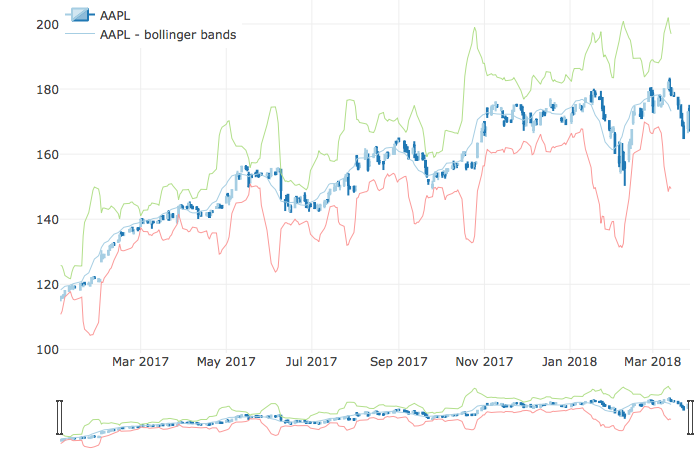

# This is  a directory for myself practice django and plotly

## This apps using Django2.0 and Plot to try plotting the Stock Price.
### Reference Links
Example [dash-stock-tickers-demo](https://github.com/plotly/dash-stock-tickers-demo-app) from official Plotly Dash

Another example from [ned2](https://github.com/ned2/dash-django-example)

This example is based on tutorial which implemented in Django 1.11.8 which provided by [justdjango](https://github.com/justdjango/My_Dashboard/blob/master/requirements.txt)

I modified a bit in order to work out with Django version 2.

